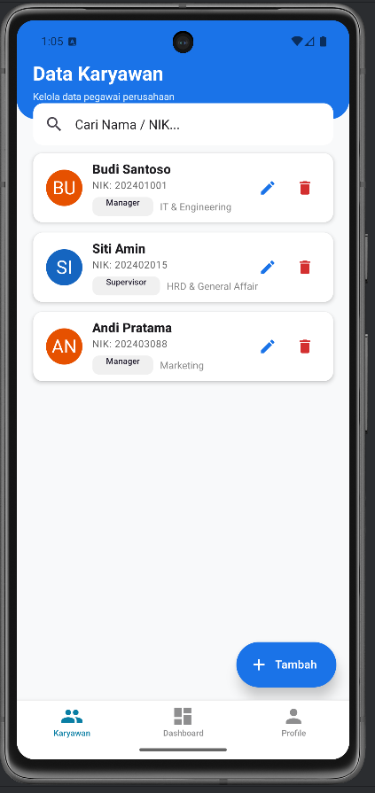
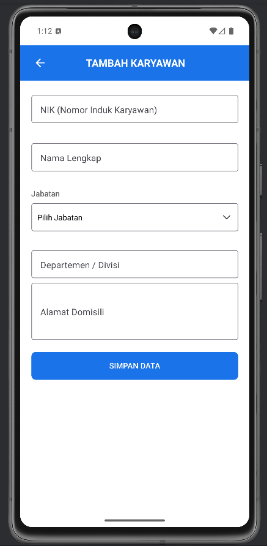

# Employee Management System (EMS)

A comprehensive full-stack mobile application designed to streamline Human Resource operations. Built with **React Native (Expo)** and **Express.js**, this system allows for real-time management of employee data.

## Screenshots

| Dashboard | Employee List | Form Input |
|:---:|:---:|:---:|
|  |  |  |

*(Note: Screenshots are located in the `docs/screenshots` folder)*

## Key Features

* **Interactive Dashboard**: Real-time visualization of employee distribution.
* **Employee Directory**: Searchable list with detailed profiles.
* **CRUD Operations**: Create, Read, Update, and Delete employee records.
* **Modern UI/UX**: Built with **React Native Paper** (Material Design 3).

## 🛠 Technology Stack

### Mobile Frontend
* **Framework**: React Native (Expo SDK 52)
* **Language**: TypeScript
* **HTTP Client**: Axios
* **UI Library**: React Native Paper

### Backend API
* **Framework**: Express.js
* **Database**: MySQL
* **ORM**: Prisma
* **Runtime**: Node.js

---

## ⚙️ Installation & Setup Guide

**Download Full Guide:**
👉 **[Installation & Setup Guide (PDF)](./docs/INSTALLATION & SETUP GUIDE.pdf)**

